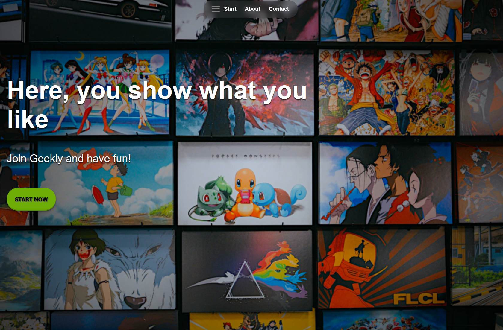

# 🎌 Geekly - Landing Page

Landing page responsiva para a Geekly, uma plataforma fictícia voltada ao público geek, com destaque para mangás e HQs.

🔗 **Demo:** [[link do Geekly]](https://soares-kaue.github.io/landing-page-geekly/)



## Seções

- **Start:** seção principal com chamada para ação ("Join Geekly and have fun!") e botão *Start Now*
- **Mangás & HQs:** carrossel de cards com o gênero de cada obra (Shōnen, Seinen, Comédia romântica...)
- **About:** ⚠️ *em desenvolvimento*
- **Contact:** seção para entrar em contato com o suporte

## Funcionalidades

- Menu de navegação flutuante
- Carrossel de mangás e HQs com botões de anterior e próximo
- Botão de favoritar em cada card
- Layout responsivo ⚠️ *em melhoria*

## Tecnologias

- HTML5 semântico
- CSS3 ([Flexbox / Grid / media queries / animações])
- JavaScript (carrossel, menu e favoritos)

## Como rodar localmente

1. Clone o repositório:
```bash
   git clone https://github.com/soares-kaue/landing-page-geekly.git
```
2. Entre na pasta:
```bash
   cd landing-page-geekly
```
3. Abra o `index.html` no navegador.

## O que aprendi

- Estruturar uma página com HTML semântico
- Criar layouts responsivos com CSS
- Construir um carrossel interativo com JavaScript
- Publicar um site com GitHub Pages

## Autor

**Kauê Soares**
[LinkedIn](https://www.linkedin.com/in/iamkaue) · office.kauesoares@gmail.com
